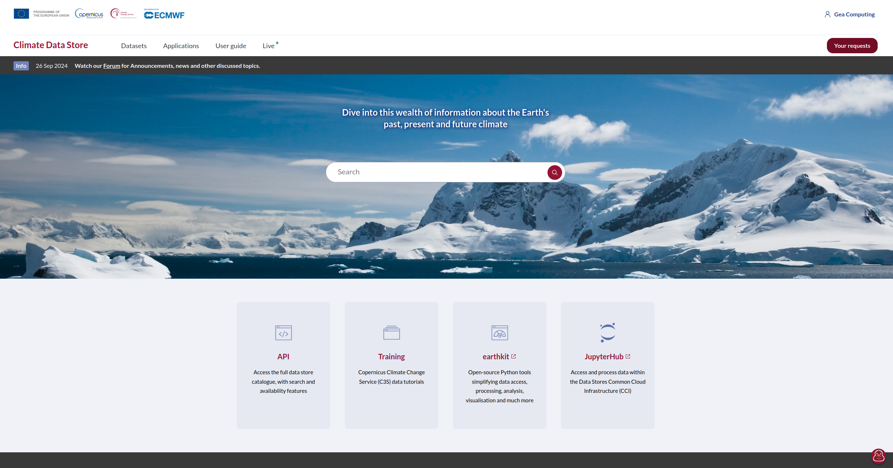
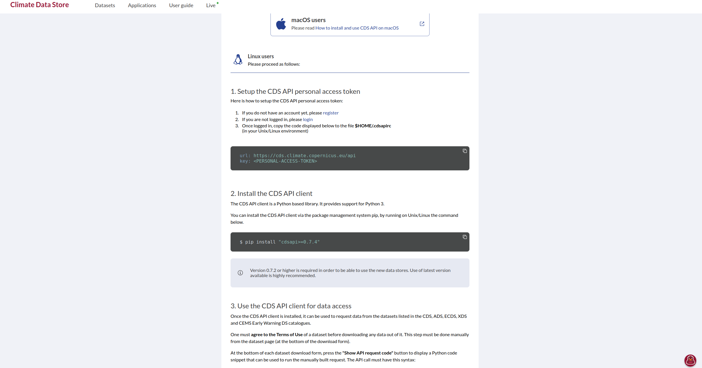
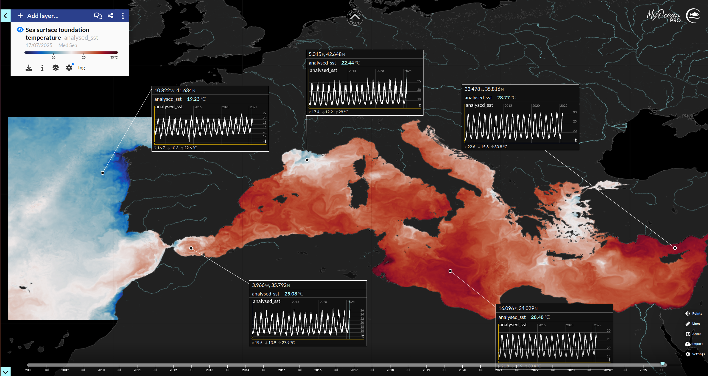

# Training_UCY_2Sept
TETHYS Summer School - Hands on Session

## Workshop Overview & Why Copernicus Data?

This workshop is designed to equip participants with practical skills in handling and analyzing Earth Sciences data using Python. Throughout the day, you will explore binary data formats like GRIB2 and NetCDF4, understand their internal structure, and learn how to leverage powerful Python libraries such as `xarray` and `cartopy` for data manipulation and visualization.

A core part of the workshop focuses on accessing and working with **Copernicus** data — Europe’s flagship Earth observation program. **Note:** In this training, we will be working **exclusively with model-based data products** (i.e., forecast, reanalysis, or climate model outputs), and not with satellite imagery or raw in-situ data.

#### Why Copernicus?

Copernicus provides open, free, and high-quality climate and environmental data gathered from satellites, in-situ sensors, and models. The datasets are:

- **Comprehensive and Multi-dimensional**: Covering atmospheric, oceanic, land, and climate variables at global and regional scales.
- **Consistent and Reliable**: Maintained by trusted European institutions with rigorous quality control.
- **Timely and Updated**: Offering near-real-time monitoring and long historical records essential for scientific research and environmental decision-making.
- **Open Access**: Freely available to everyone, promoting transparency and collaborative research worldwide.

By mastering Copernicus **model data** access and analysis workflows, participants will be empowered to conduct robust environmental assessments, climate diagnostics, and develop reproducible tools for sustainability and policy.


# Workshop Agenda  
### Earth Sciences Data Analysis with Python  

| Time           | Session Description                                             |
|----------------|-----------------------------------------------------------------|
| 09:00 - 09:15  | Welcome & Introduction to the Day                               |
| 09:15 - 10:00  | Overview of Binary Data in Earth Sciences (NetCDF4)      |
| 10:00 - 10:45  | Structure and Architecture of NetCDF Files                      |
| 10:45 - 11:00  | Introduction to Copernicus & Practical Copernicus Example       |
| 11:00 - 11:30  | Python Essentials for Scientific Data Analysis                  |
| 11:30 - 13:00  | Introduction to xarray: Why and How                             |
| 13:00 - 13:45  | Lunch Break                                                     |
| 13:45 - 14:30  | Downloading Data from Copernicus API (Account & Setup)          |
| 14:30 - 15:15  | Working with NetCDF in Python using xarray                      |
| 15:15 - 16:00  | Data Slicing, Time Series Extraction, Anomaly & Climatology Computation |
| 16:00 - 16:45  | Visualization: From Time Series to Publication-Ready Maps with cartopy |
| 16:45 - 17:15  | Final Q&A, Wrap-Up, and Sharing of Resources                    |


## Run the notebook on Google Colab

## Running on Google Colab

This project can be run on [Google Colab](https://colab.research.google.com), which provides free cloud-based Jupyter notebooks.

> **Note:** To use Google Colab, you need a valid Google account. Please ensure you are signed in with your Google credentials to run the notebooks successfully.


Each notebook file can be opened by clicking on its name or the **“Open in Colab”** badge. This will take you directly to Google Colab, where the notebook is pre-configured with all necessary environments and dependencies — ready to run immediately.


## Theory

Below are the notebooks covering theoretical concepts. Click the **Open in Colab** badges to launch each notebook directly in Google Colab with environment setup ready.

[1_start_here.ipynb](https://colab.research.google.com/github/geacomputing/UCY2Sept/blob/main/Python_code/Theory/1_start_here.ipynb)  
[](https://colab.research.google.com/github/geacomputing/UCY2Sept/blob/main/Python_code/Theory/1_start_here.ipynb)

[2_Type_of_Variables.ipynb](https://colab.research.google.com/github/geacomputing/UCY2Sept/blob/main/Python_code/Theory/2_Type_of_Variables.ipynb)  
[](https://colab.research.google.com/github/geacomputing/UCY2Sept/blob/main/Python_code/Theory/2_Type_of_Variables.ipynb)

[3_Structure_and_Architecture_of_NetCDF_Files.ipynb](https://colab.research.google.com/github/geacomputing/UCY2Sept/blob/main/Python_code/Theory/3_Structure_and_Architecture_of_NetCDF_Files.ipynb)  
[](https://colab.research.google.com/github/geacomputing/UCY2Sept/blob/main/Python_code/Theory/3_Structure_and_Architecture_of_NetCDF_Files.ipynb)

[4_Introduction_to_Copernicus_and_Practical_Copernicus_Example.ipynb](https://colab.research.google.com/github/geacomputing/UCY2Sept/blob/main/Python_code/Theory/4_Introduction_%20to_Copernicus_and_Practical_Copernicus_Example.ipynb)  
[](https://colab.research.google.com/github/geacomputing/UCY2Sept/blob/main/Python_code/Theory/4_Introduction_%20to_Copernicus_and_Practical_Copernicus_Example.ipynb)

[5_Introduction_to_xarray.ipynb](https://colab.research.google.com/github/geacomputing/UCY2Sept/blob/main/Python_code/Theory/5_Introduction_to_xarray.ipynb)  
[](https://colab.research.google.com/github/geacomputing/UCY2Sept/blob/main/Python_code/Theory/5_Introduction_to_xarray.ipynb)

---

## Hands-on

[5-A_Challenge_Daily_climatology.ipynb](https://github.com/geacomputing/UCY2Sept/blob/main/Python_code/Hands-on/5-A_Challenge_Daily_climatology.ipynb)  
[](https://colab.research.google.com/github/geacomputing/UCY2Sept/blob/main/Python_code/Hands-on/5-A_Challenge_Daily_climatology.ipynb)

[6_Downloading_Data_from_Copernicus_API.ipynb](https://github.com/geacomputing/UCY2Sept/blob/main/Python_code/Hands-on/6_Downloading_Data_from_Copernicus_API.ipynb)  
[](https://colab.research.google.com/github/geacomputing/UCY2Sept/blob/main/Python_code/Hands-on/6_Downloading_Data_from_Copernicus_API.ipynb)

[7_Working_with_NetCDF_in_Python_using_xarray.ipynb](https://github.com/geacomputing/UCY2Sept/blob/main/Python_code/Hands-on/7_Working_with_NetCDF_in_Python_using_xarray.ipynb)  
[](https://colab.research.google.com/github/geacomputing/UCY2Sept/blob/main/Python_code/Hands-on/7_Working_with_NetCDF_in_Python_using_xarray.ipynb)

[8_Maps_with_cartopy.ipynb](https://github.com/geacomputing/UCY2Sept/blob/main/Python_code/Hands-on/8_Maps_with_cartopy.ipynb)  
[](https://colab.research.google.com/github/geacomputing/UCY2Sept/blob/main/Python_code/Hands-on/8_Maps_with_cartopy.ipynb)


---
---


## COPERNICUS Credentials

Students should create an account on the [COPERNICUS website](https://cds.climate.copernicus.eu/how-to-api) and follow the instructions to retrieve their **URL** and **key** variables.

These credentials are necessary to submit simple API requests to download climate data.

Make sure to keep your credentials confidential and never share them publicly.

Here is an example of what the credentials look like in a configuration file or environment variable:

```plaintext
url: https://cds.climate.copernicus.eu/api
key: <PERSONAL-ACCESS-TOKEN>
```

### Visual Guide: Copernicus Data Store and Access Credentials




### Additional Resources

The official COPERNICCUS webpage [COPERNICUS website](https://cds.climate.copernicus.eu/how-to-api) provides detailed instructions on how to install and configure the CDS API client on your personal machine.

### Storing Credentials in Google Colab

In a typical local Linux environment, users store such credentials securely in their shell configuration files like `.bashrc` or `.bash_profile`. This approach allows the system or scripts to automatically load and use these sensitive variables without hardcoding them in scripts.

Since Google Colab is a cloud environment without persistent user home directories, we simulate this process by creating a temporary local file during the session that contains the necessary environment variables for the Copernicus Data Store API.

This method helps to:

- Keep credentials separate from the code  
- Avoid exposing keys directly in notebooks  
- Make it easier to reuse the credentials throughout the session  

Remember that this file and the environment variables exist only for the duration of your Colab session.


## Bonus Jupyter Notebook: Exploring Copernicus Marine Data

As a **bonus**, this repository includes a Jupyter Notebook that shows how to explore and download oceanographic data from the **[Copernicus Marine Service](https://marine.copernicus.eu/)**.  
This is different from the **[Copernicus Climate Data Store (CDS)](https://cds.climate.copernicus.eu/)**:  
- The **CDS** focuses on climate reanalysis, forecasts, and atmospheric data.  
- The **Marine Service** provides ocean-focused products, with **over 300 datasets** in its catalogue, including sea surface temperature, salinity, currents, sea level, ocean color, and biogeochemistry.  

### What the notebook does

1. **Install dependencies**  
   - [`copernicusmarine`](https://help.marine.copernicus.eu/en/collections/4107316-copernicus-marine-toolbox) → official toolbox to query/download data.  
   - [`xarray`](https://docs.xarray.dev/en/stable/) → handle NetCDF multidimensional data.  
   - [`matplotlib`](https://matplotlib.org/) → visualize results.  

2. **Authenticate with Copernicus Marine**  
   Uses:
   ```python
   import copernicusmarine
   copernicusmarine.login()

When you run `copernicusmarine.login()`, you will be prompted to enter your **Copernicus Marine credentials** (username and password, or API key).  
These credentials are securely stored in an **encrypted local configuration file**.  
- This means you do not need to re-enter them every time you make a request.  
- The login information persists **for the duration of your Jupyter or Google Colab session**.  
- Each time you start a new session, you will be asked to authenticate again.  

This mechanism ensures both convenience and security: your credentials are not exposed in the notebook code, but remain available while you work with Copernicus Marine datasets.

### Downloading Large Files in Colab (Without Storing Them on GitHub)

By using `copernicusmarine.login()` together with the `copernicusmarine.subset()` function, you can request and download **large datasets directly into your Colab runtime**.  

This approach has two key advantages:
1. **No need to store data in the repository**  
   The NetCDF files are downloaded only into the **active Colab session** (temporary storage).  
   This keeps your GitHub repo lightweight and avoids uploading gigabytes of binary data.  

2. **On-demand access to big data**  
   Since the files are generated dynamically from the Copernicus Marine servers, you can request exactly the spatial, temporal, and variable subsets you need — even if the original dataset is hundreds of gigabytes in size.  

⚠️ Note: Data stored in Colab is **temporary** and will be lost once the session ends. If you want to keep the files, you can manually download them from Colab to your local machine or export them to Google Drive.

[9_API_copernicus_marine.ipynb](https://github.com/geacomputing/UCY2Sept/blob/main/Python_code/Hands-on/9_API_copernicus_marine.ipynb)  
[](https://colab.research.google.com/github/geacomputing/UCY2Sept/blob/main/Python_code/Hands-on/9_API_copernicus_marine.ipynb)

### Visual Guide: Copernicus Marine Web-based visualization: MyOcean Pro


**Figure:** Visualization from *MyOcean Pro* of the dataset  
*“Mediterranean Sea High Resolution and Ultra High Resolution Sea Surface Temperature Analysis”*  
(Product ID: `SST_MED_SST_L4_NRT_OBSERVATIONS_010_004`).  
This Level-4 satellite-based product provides **daily sea surface temperature (SST)** fields over the **Mediterranean Sea**  
(lat: 30.25°–46°, lon: -18.12°–36.25°) at a spatial resolution of **0.01° × 0.01°**.  
The dataset covers the period **1 Jan 2008 – 18 Aug 2025** and is updated **daily** (typically at 12:00 and 15:00).  

In the figure, **five user-selected pin points** are visible on the active data map.  
These pins allow users to **extract time series of SST values at specific locations**, enabling localized temporal analysis in addition to the full gridded fields.


## Copernicus Marine MyOcean Pro
It allows you to explore, in real time, all the products available in the catalogue (over 300 datasets), without having to download them first.  

Key features include:
- **Interactive map navigation** → zoom and pan across global and regional oceans.  
- **Overlay multiple products** → for example, compare sea surface temperature with currents or salinity.  
- **Time navigation** → step forward/backward in time or animate a product to view its temporal evolution.  
- **Vertical exploration** → for 3D products, browse different **depth levels** in the ocean.  
- **Custom visualization settings** → adjust color maps, value ranges, contour steps, and other display options to best highlight the data.  

This makes *MyOcean Pro* an excellent companion to the Python-based workflow: you can first **explore datasets visually** online, then use the Copernicus Marine Toolbox to **download tailored subsets** for deeper analysis in Jupyter or Colab.


## Event Materials

This repository also contains a PDF slideshow used during the event. Everything that was projected and presented is available here, so don’t worry if you miss something — you can always retrieve it from this repo.
Also, there is a video realized in ParaView, to animate SST data, downloaded and processed from Copernicus Marine:

### Watch the Video
[](https://youtu.be/7VTVGDZSS0g)

## About GEA COMPUTING


**GEA COMPUTING Ltd.** is a software development and consulting company focused on environmental data science, geospatial analytics, and scientific computing.  
We design and build tools and platforms to process, visualize, and interpret Earth observation and climate data efficiently—leveraging open-source technologies and promoting reproducible research practices.

Beyond software, we specialize in **training researchers, institutions, and professionals**, helping them gain hands-on skills in climate data workflows, geospatial processing, and Python-based analysis.


| Company                | EMS GEA Computing LTD             |
|------------------------|---------------------------------|
| Email                  | office@geacomputing.eu           |
| Website                | [www.gea-computing.eu](https://www.gea-computing.eu) |
| Instagram              | [ems_gea_computing](https://www.instagram.com/ems_gea_computing/) |
